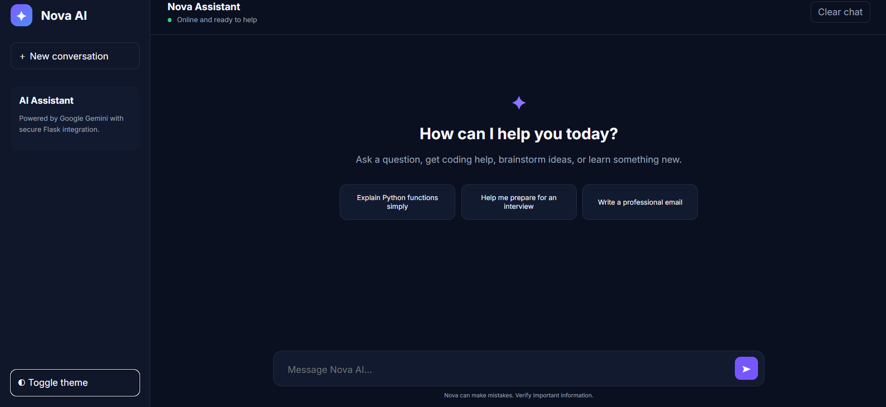
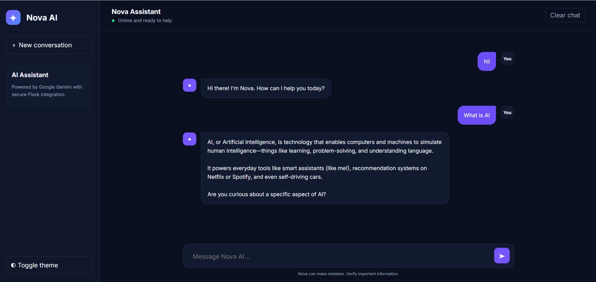
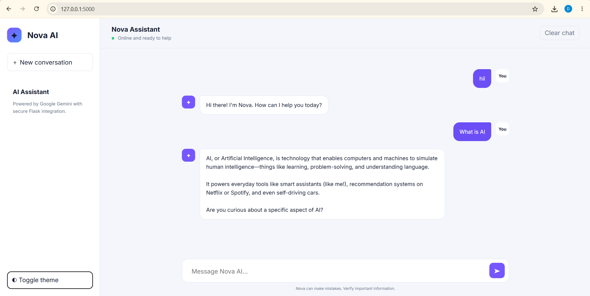
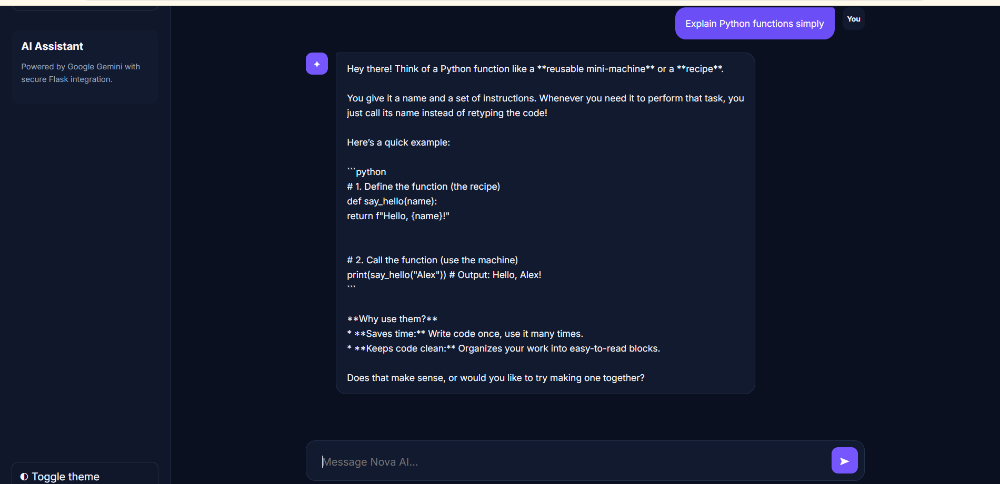

# Nova AI Chatbot

A modern AI chatbot built with Python Flask, Google Gemini, SQLite, HTML, CSS, and JavaScript.

## Features

- Gemini-powered AI responses
- Persistent SQLite chat history
- Responsive modern chat interface
- Dark and light themes
- Typing indicator and suggested prompts
- Clear conversation option
- Secure environment-variable configuration

## Project Screenshots

### Welcome Screen



### AI Conversation



### Light Theme



### Coding Assistance



## Run locally

```bash
python -m venv .venv
# Windows: .venv\Scripts\activate
pip install -r requirements.txt
copy .env.example .env
flask --app app init-db
flask --app app run
```

Add your Gemini API key to `.env`, then open `http://127.0.0.1:5000`.

## Author

Deeksha TM
